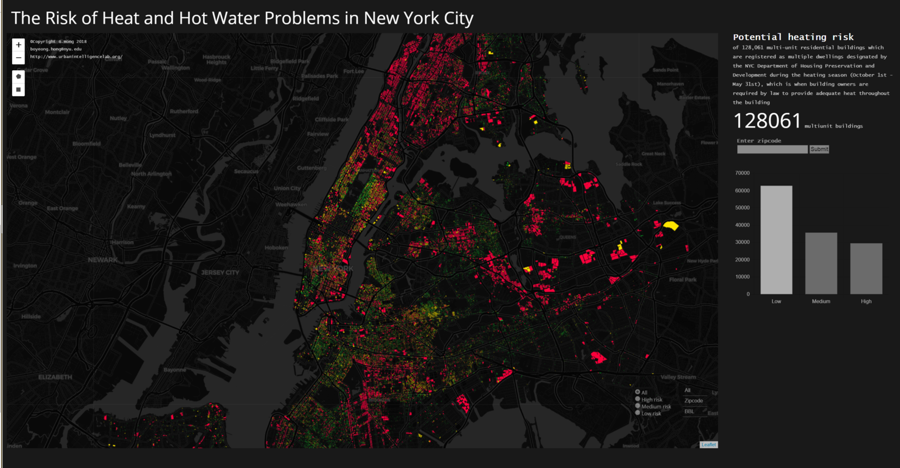

# Heating Risk Mapping Project
### Data Visualization 

© boyeong Hong, bh1555@nyu.edu
© UrbanIntelligenceLab

* Link to the visualization: http://bl.ocks.org/CUSP2015BO/raw/32d115620dbd30618dfe70d445af9493/
* Link to JSBin: https://jsbin.com/kayutaj/edit?html,css,js

## 01 Objectives of the projects
This project is based on the current project, "Predicting Heat and Hot water Problem risk of Multiunit builgins in New York City', of Urban Intelligence Lab. The main aim of this data visualization project is building interactive visualization tools including map and charts for users to play around and explore the heating risk issue and the regional characteristics. Brief context of the project is as followings.

Scenario
* Starting from the flow chart of heat and hot water related 311 complaints - HPD problems - HPD violations of multiple dwellings during 2012-2016 heating seasons
* If residents do not report their housing condition issues due to some reasons? Inspection never happen.
* Evaluating living condition or risk at as ground-truth is developed to overcome 311 and HPD data bias.

Hypothesis and project scope
* Consider a sample of 128,061 multi-unit residential buildings which are registered as multiple dwellings designated by the NYC Department of Housing Preservation and Development
* Exclude one and two-family housings where the owner usually lives in the buildings, since I assume that these smaller homes will address heating issues differently than multi-tenant buildings. 
* Narrow the time period of the project to focus only on the heating season between October 1st and May 31st, which is when building owners are required by law to provide adequate heat throughout the building.
* According to the descriptive analysis, approximately 90% of heat and hot water complaints during the heating season are reported from multiple dwellings, such as walk-up and elevator apartment buildings. 

HPD inspection and violation
* Filtered based on Housing Maintenance Code (HMC) violations for sections 27-2005, 27-2028, 27-2029, 27-2031 or 27-2033.
For example, the code ‘27-2029’ represents a violations for failure to provide the minimum supply of heat or hot water during the heating season.

Methodologies
* Gradient Boosting Classifier algorithm is used to predict the likelihood of heat and hot water problems at the building-level across the city in 2016-2017 heating season
* Training set: 2012-2016 heating season
* Predictors: building physical condition, property characteristics, management structure, and building mechanical systems (e.g. boilers)

## 02 Data set involves
As mentioned above, this visualization project is based on the result of the research project. Main data set is the likelihood of heat and hot water issues at the building level associated with Borough-Block-Lot, address, zipcode, building age, building class, the number of units, the number of heat and hot water related violations and problems (issued by NYC Depepartment of Housing Preservation and Development), and the number of heat and hot water related 311 complaints.

## 03 Descriptions on the visualization design choices
Main Visualizations components and functions
* BBL level prediction result: the likelihood of heat and hot water problems at the building-level in 2016-2017 heating season (absolute values or low-medium-high risk buckets)
* Click feature → showing additional features (build year, #of units)
* Neighborhood level result: the average likelihood of heat and hot water problems at the zipcode-level in 2016-2017 heating season
* Interaction function: type zipcode
* The number of low-medium-high risk buildings in each selections (bar graph)
* Zipcode is the most familiar and manageable spatial resolution, in particular from user side. For instance, if people are asked to tell their neighborhood, all the types of answers will be different and it is hard to determine neighborhood boundaries. But, zipcode formatted as 5-digit is obvious!

Design strategies
* Visible and intuitive colors of map (high risk: red, medium risk: yellow, low risk: green)
* Monotonic color of non-map compnents to focus on the map visualization
* Flexible and relative size of components to adjust differnt device size (which is really challenging!)
* Text as a part of image - important texts are represented as bigger size and fool bright color

## 04 Outcome and Evaluation
So, this data visualization is a quite challenging project, which is really time-demanding and labor-intensive. In order to figure out many errors and small design issues (even opacity, text size, etc.) I should google the issues every times. The most difficult (and still confusing) part is setting position and size of components. I have learned a lot of terms and functions such as 'absolute', 'relative', 'px', 'vh', 'vw', et cetera. I think that the visualization looks pretty good to show the heating risk at the building level in the city and provide some interactive fuctions (draw polygons, type zipcode, change the result number and chart etc.). However, I would like to spend more time to develop much more sophisticated visualization tool. First, If the map zoom into the selected features (based on polygon drawing or zipcode typing), it would be great. Second, color matching between the map and the bar chart is required to represent the same color-scheme information. Third, information window might be better to provide additional information instead of pop-up window on the selected feature. Despite these limitations, building this visualization tool is really fun and valuabable outcome for my research project. 

